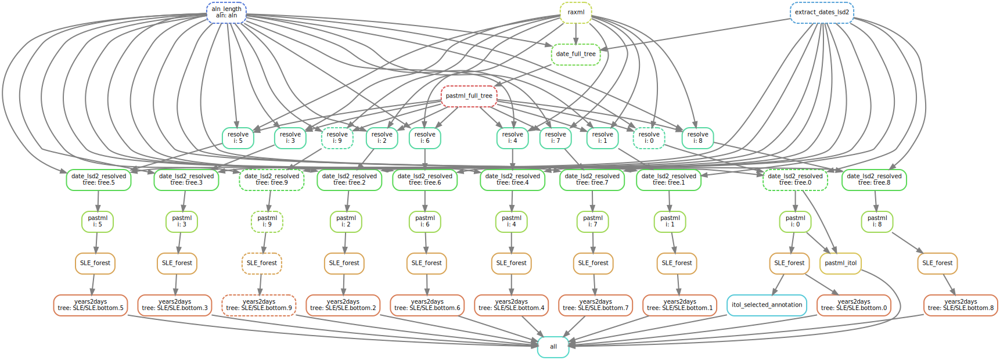

# Ebola SLE 2014 epidemic analysis

## Data

We took the 1,610 sequence alignment and metadata (sampling times and countries) 
that were used in the study by [Dudas _et al._ 2017](https://www.nature.com/articles/nature22040), 
downloaded from [github.com/ebov/space-time](https://github.com/ebov/space-time/tree/master/Data) 
and saved here as:
 * [data/aln.ids.fa](data/aln.ids.fa) -- multiple sequence alignment;
 * [data/metadata.csv](data/metadata.csv) -- metadata.
 
The original data are available under [Creative Commons Attribution Share Alike 4.0 International licence](LICENCE.txt), the same licance applies to the results that we obtained from it (see below).

### SLE forests

We reconstructed the maximum likelihood phylogeny for this alignment with RAxML-NG (v1.0.2, GTR+G4+FO+IO) [[Kozlov _et al._ 2019](https://pubmed.ncbi.nlm.nih.gov/31070718/)], 
and rooted it based on sampling dates using LSD2 (v2.4.1, strict clock with outlier removal) [[To _et al._ 2016](https://academic.oup.com/sysbio/article/65/1/82/2461506)]:
 * [data/tree.nwk](data/tree.nwk) -- phylogeny
 * [data/timetree.nexus](data/timetree.nexus) -- rooted (and time-scaled) tree

We reconstructed the ancestral characters for country with PastML on this tree
(v1.9.40, MPPA+F81) [[Ishikawa, Zhukova _et al._ 2019](https://academic.oup.com/mbe/article/36/9/2069/5498561)]:
 * [data/pastml/named.tree_timetree.nwk](data/pastml/named.tree_timetree.nwk) -- country-annotated timetree

As Ebola's mutation rate is slower than its transmission rate, the initial phylogeny contained 242 polytomies. BDEI
model, on the other hand, assumes a binary tree. We therefore resolved these polytomies randomly on the initial phylogeny, 
rooted as the timetree and without outliers. The resolution was performed 10 times (to check for
robustness of the estimates) using a coalescent approach (and, when possible, keeping the nodes in the same country in the same subtree).

We dated each of the 10 trees with LSD2 (v2.4.1 [[github.com/tothuhien/lsd2](github.com/tothuhien/lsd2/tree/v1.10)], 
under strict molecular clock, without outlier removal as they were removed at the previous dating) using tip sampling dates, 
and reconstructed the ancestral characters for country with PastML
(v1.9.40, MPPA+F81) [[Ishikawa, Zhukova _et al._ 2019](https://academic.oup.com/mbe/article/36/9/2069/5498561)]:
 * [data/pastml/0-9/named.tree_timetree.nwk](data/pastml) -- country-annotated fully resolved timetree
 * [data/timetree.0.itol](data/timetree.0.itol) -- iTOL [[Letunic & Bork 2019](https://academic.oup.com/nar/article/47/W1/W256/5424068?login=true)]  visualization of one of these trees.

Lastly, we extracted 10 SLE forests from these trees to represent the Ebola epidemic in SLE between July 30 2014 (when the SLE
government began to deploy troops to enforce quarantines according to [news24.com](https://web.archive.org/web/20190505224120/https://www.news24.com/Africa/News/Sierra-Leone-Liberia-deploy-troops-for-Ebola-20140804)) 
 and September 7 2015 (the last SLE sample in these trees) by 
1. cutting each tree on July 30 2014 to remove the more ancient part (with a different health policy); 
2. among the July-31-on trees, picking those whose root’s predicted character state for country was SLE; 
3. removing the non-SLE subtrees from the selected July-31-on SLE trees to focus on the epidemic within the country, 
without further reintroductions.

For each of the SLE forests we converted its tree branch lengths to days:
 * [data/SLE/SLE.bottom.0-9.days.nwk](data/SLE)



### Pipeline


The [Snakemake_data](Snakemake_data) file contains 
a Snakemake [[Köster *et al.*, 2012](https://doi.org/10.1093/bioinformatics/bts480)] pipeline 
that reconstructs the 10 SLE forests as described above.

It can be rerun as:
```bash
snakemake --snakefile Snakefile_data --keep-going  --config folder=data --use-singularity --singularity-prefix ~/.singularity --singularity-args "--home ~"
```

# BDEI parameter estimation

We estimated the BDEI parameters on these 10 forests, fixing the sampling probability ρ (for model identifiability).

###  Sampling probability ρ estimate
We estimated ρ as the proportion of cases represented by our forests (853–854) with respect to the total number of SLE Ebola
cases reported by the Centers for Disease Control and Prevention ([CDC](https://www.cdc.gov/vhf/ebola/history/2014-2016-outbreak/case-counts.html))
 between September 8, 2015 (the closest date to the last SLE sample in our data set, 13 683 cases) 
and July 31 (the day following the quarantine measures start, 533 cases):
ρ ≈ 854/(13 683 − 533) ≈ 0.065 (calculated independently for each forest). 

###  Additional settings
To check the robustness of the predictions with respect to this estimation of ρ, we additionally
estimated the parameter values assuming 20% more (15 780, ρ ≈ 0.054) and 20% less
(10 520, ρ ≈ 0.081) total cases. 

For each of these settings we performed three estimations:
1. with the number of unobserved trees being estimated
2. with it being fixed (via setting the parameter u) to the difference between the total number of SLE Ebola cases
 reported by the CDC on July 31 (533) and the number of trees in the corresponding forest
(varying between 143 and 174)
3. with it being fixed to zero.

### Pipeline

The [Snakemake_estimate](Snakemake_estimate) file contains 
a Snakemake pipeline for parameter estimation.

It can be rerun as:
```bash
snakemake --snakefile Snakefile_estimate --keep-going  --config folder=.
```

The results are listed in [data/SLE/estimates.tab](data/SLE/estimates.tab).
