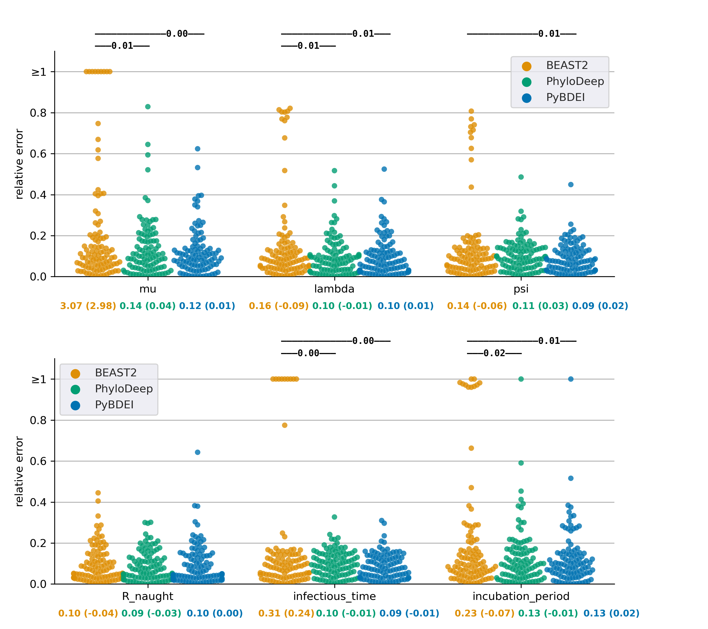
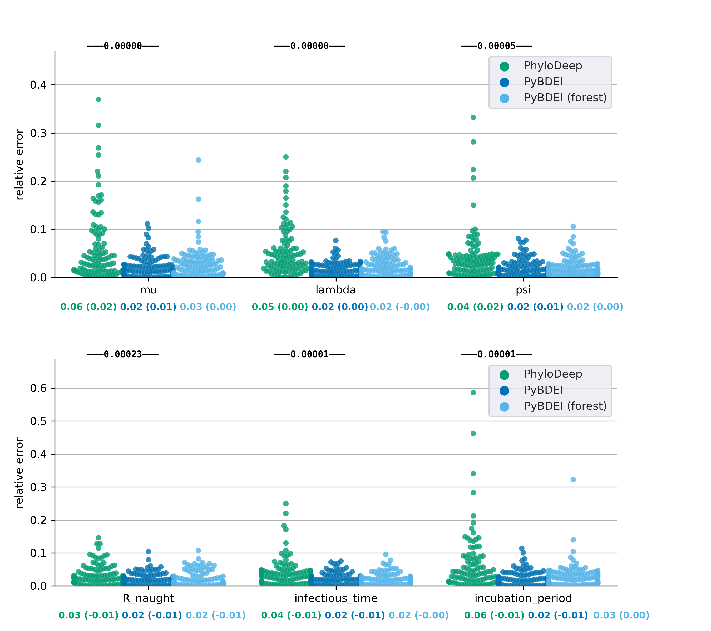

# Performance on simulated data

## Simulated data

We assessed the performance of our estimator on two data sets: (1) __medium__, a data set of 
100 medium-sized trees (200 − 500 tips), 
and (2) __large__, a data set of 100 large trees (5 000 − 10 000 tips) 
from [Voznica _et al._ 2021](https://doi.org/10.1101/2021.03.11.435006).

### Medium and large tree data sets
The data were downloaded from [github.com/evolbioinfo/phylodeep](https://github.com/evolbioinfo/phylodeep) and include:
 * medium trees: [trees.nwk](medium/trees.nwk), split by tree in [tree.[0-99].nwk](medium/trees)
 * large trees: [trees.nwk](large/trees.nwk), split by tree in [tree.[0-99].nwk](large/trees)
 * real parameter values for medium trees: [TARGET.csv](medium/TARGET.csv), split by tree in [tree.[0-99].log](medium/trees)
 * real parameter values for large trees: [TARGET.csv](large/TARGET.csv), split by tree in [tree.[0-99].log](large/trees)
 * parameter values estimated by BEAST2 on medium trees: [BEAST2.csv](medium/BEAST2.csv)
 * parameter values estimated by PhyloDeep on medium trees: [CNN_CBLV.csv](medium/CNN_CBLV.csv)
 * parameter values estimated by PhyloDeep on large trees: [CNN_CBLV.csv](large/CNN_CBLV.csv)

To produce medium trees, Voznica _et al._ generated 10 000 trees with 200 − 500 tips under BDEI model, 
with the parameter values sampled uniformly at random within the following boundaries: 
 * incubation period 1/µ ∈ [0.2, 50]
 * basic reproductive number R<sub>0</sub> = λ/ψ ∈ [1, 5]
 * infectious period ψ ∈ [1, 10]. 

Then randomly selected 100 out of those 10 000 trees to evaluate them with the gold standard method, BEAST2. 

For 100 large tree generation, the same parameter values as for the 100 medium ones were used, 
but the tree size varied between 5000 and 10 000 tips.

As the BDEI model requires one of the parameters to be fixed in order to become asymptomatically identifiable, 
ρ was fixed to the real value.

### Large forest data set
PhyloDeep's maximal pre-trained tree size is 500, 
however for larger trees it estimates BDEI parameters by extracting the largest non-intersecting set of subtrees 
of sizes covered by the pre-trained set (50-500 tips), estimating parameters on each of the subtrees independently, 
and averaging each parameter's value over the subtrees (weighted by subtree sizes). 
To compare our method's performance on the forest of such subtrees, 
we generated a large forest data set by dissecting each large tree into subtrees with Phylo Deep:
 * forest of subtrees for each large trees: [cluster.[0-99].nwk](large/clusters)
 * real parameter values for such forests: [cluster.[0-99].log](large/clusters)

## Data preparation pipeline 

The [Snakemake_data](Snakemake_data) file contains 
a Snakemake [[Köster *et al.*, 2012](https://doi.org/10.1093/bioinformatics/bts480)] pipeline 
that splits the trees into separate files (one per tree), and generates the large forest data set.

It can be rerun as:
```bash
snakemake --snakefile Snakefile_data --keep-going --keep-going --cores 4 --use-singularity --singularity-prefix ~/.singularity --singularity-args "--home ~"
```


## Parameter estimation pipeline 

The [Snakemake_estimate](Snakemake_estimate) file contains 
a Snakemake pipeline that estimated the BDEI parameters (fixing ρ to the real value; 
as well as fixing the other parameters to real values one by one) 
on the trees and forests of the medium and large data sets.

The [Snakemake_viz](Snakemake_viz) file contains a Snakemake pipeline that visualized the results.


The estimated parameters for fixed ρ can be found in 
the [medium/estimates.tab](medium/estimates.tab) and [large/estimates.tab](large/estimates.tab) tables, 

The estimated parameters, with each of the parameters separately fixed to the real value, can be found in 
the [medium/estimates_tree_mu_la_psi_p.tab](medium/estimates_tree_mu_la_psi_p.tab) and [large/estimates_tree_mu_la_psi_p.tab](large/estimates_tree_mu_la_psi_p.tab) tables..

It can be rerun as:
```bash
snakemake --snakefile Snakefile_estimate --keep-going --use-singularity --singularity-prefix ~/.singularity --singularity-args "--home ~"
snakemake --snakefile Snakefile_viz --keep-going --use-singularity --singularity-prefix ~/.singularity --singularity-args "--home ~"
```

#### Relative errors on the medium data set


#### Relative errors on the large data set



## Time pipeline 

The [Snakemake_time](Snakemake_time) file contains 
a Snakemake pipeline that computes statistics on running times and numbers of iterations needed for convergence.

It can be rerun as:
```bash
snakemake --snakefile Snakefile_time --keep-going --use-singularity --singularity-prefix ~/.singularity --singularity-args "--home ~"
```