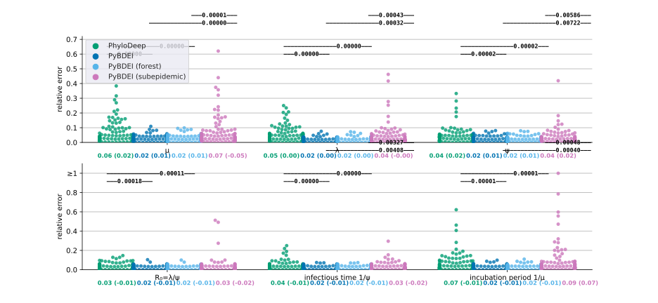

# Performance on simulated data

## Simulated data

We assessed the performance of our estimator on two data sets: (1) __medium__, a data set of 
100 medium-sized trees (200 − 500 tips), 
and (2) __large__, a data set of 100 large trees (5 000 − 10 000 tips) 
from [Voznica _et al._ 2021](https://doi.org/10.1101/2021.03.11.435006).

### Medium and large tree data sets
The data were downloaded from [github.com/evolbioinfo/phylodeep](https://github.com/evolbioinfo/phylodeep) and include:
 * medium trees: [trees.nwk](medium/trees.nwk), split by tree in [tree.[0-99].nwk](medium/trees)
 * large trees: [trees.nwk](large/trees.nwk), split by tree in [tree.[0-99].nwk](large/trees)
 * real parameter values for medium trees: [TARGET.csv](medium/TARGET.csv), split by tree in [tree.[0-99].log](medium/trees)
 * real parameter values for large trees: [TARGET.csv](large/TARGET.csv), split by tree in [tree.[0-99].log](large/trees)
 * parameter values estimated by BEAST2 on medium trees: [BEAST2.csv](medium/BEAST2.csv)
 * parameter values estimated by PhyloDeep on medium trees: [CNN_CBLV.csv](medium/CNN_CBLV.csv)
 * parameter values estimated by PhyloDeep on large trees: [CNN_CBLV.csv](large/CNN_CBLV.csv)

To produce medium trees, Voznica _et al._ generated 10 000 trees with 200 − 500 tips under BDEI model, 
with the parameter values sampled uniformly at random within the following boundaries: 
 * incubation period 1/µ ∈ [0.2, 50]
 * basic reproductive number R<sub>0</sub> = λ/ψ ∈ [1, 5]
 * infectious period ψ ∈ [1, 10]
 * sampling probability ρ ∈ [0.01, 1[.

Then randomly selected 100 out of those 10 000 trees to evaluate them with the standard Bayesian method, BEAST2. 

For 100 large tree generation, the same parameter values as for the 100 medium ones were used, 
but the tree size varied between 5000 and 10 000 tips.

As the BDEI model requires one of the parameters to be fixed in order to become asymptomatically identifiable, 
ρ was fixed to the real value.

### Large forest data set
To evaluate PyBDEI performance on forests, we additionally generated two types of
forests for the large data set. 

#### Type 1 forests (e.g. health policy change)
The first type of forests was produced by cutting the oldest
(i.e., closest to the root) 25% of each full tree, and keeping the forest of bottom-75%
subtrees (in terms of time). We hence obtained 100 forests representing sup-epidemics that
all started at the same time. They can be found in [large/forests](large/forests) folder.

#### Type 2 forests (e.g. multiple introductions to a country)
The second type of forests represented epidemics that started with multiple
introductions happening at different times. To generate them we 
1. took the parameter values Θ<sub>i</sub> corresponding to each tree _Tree_<sub>i</sub> in the large dataset
(i ∈ {1, . . . , 100})
2. calculated the time T<sub>i</sub> between the start of the tree _Tree_<sub>i</sub> and the time
of its last sampled tip
3. kept 
   1. uniformly drawing a time T<sub>i,j</sub> ∈ [0, Ti], and
   2. generating a (potentially hidden) tree _Tree_<sub>i,j</sub> 
under parameters Θ<sub>i</sub> till reaching the time T<sub>i,j</sub>. 

Steps (3.i) and (3.ii) were repeated till the total number of sampled tips 
in the generated trees reached at least 5 000: tips(_Tree_<sub>i,j</sub>) ⩾ 5 000. 
The resulting forest F<sub>i</sub> included those of the trees _Tree_<sub>i,j</sub> that contained at least one sampled tip (i.e., observed trees). 
These forests can be found in [large/subepidemics](large/subepidemics) folder.

## Data preparation pipeline 

The [Snakemake_data](Snakemake_data) file contains 
a Snakemake [[Köster *et al.*, 2012](https://doi.org/10.1093/bioinformatics/bts480)] pipeline 
that splits the trees into separate files (one per tree), and generates the large forest data sets.


It can be rerun as:
```bash
snakemake --snakefile Snakefile_data --keep-going --keep-going --cores 4 --use-singularity --singularity-prefix ~/.singularity --singularity-args "--home ~"
```


## Parameter estimation pipeline 

The [Snakemake_estimate](Snakemake_estimate) file contains 
a Snakemake pipeline that estimated the BDEI parameters (fixing ρ to the real value; 
as well as fixing the other parameters to real values one by one) 
on the trees and forests of the medium and large data sets.

The [Snakemake_viz](Snakemake_viz) file contains a Snakemake pipeline that visualized the results.


The [Snakemake_u](Snakemake_u) file contains a Snakemake pipeline that assesses different setting 
of the u parameter (number of hidden trees) on the simulated forests.


The estimated parameters for fixed ρ can be found in 
the [medium/estimates.tab](medium/estimates.tab) and [large/estimates.tab](large/estimates.tab) tables.

The estimated parameters, with each of the parameters separately fixed to the real value, 
can be found in the [large/estimates_tree_mu_la_psi_p.tab](large/estimates_tree_mu_la_psi_p.tab) tables.

It can be rerun as:
```bash
snakemake --snakefile Snakefile_estimate --keep-going --use-singularity --singularity-prefix ~/.singularity --singularity-args "--home ~"
snakemake --snakefile Snakefile_viz --keep-going --use-singularity --singularity-prefix ~/.singularity --singularity-args "--home ~"
```

#### Relative errors on the medium data set


#### Relative errors on the large data set


#### Relative errors with different u settings the large forests of type 1


#### Relative errors with different u settings the large forests of type 2


## Time pipeline 

The [Snakemake_time](Snakemake_time) file contains 
a Snakemake pipeline that computes statistics on running times and numbers of iterations needed for convergence.

It can be rerun as:
```bash
snakemake --snakefile Snakefile_time --keep-going --use-singularity --singularity-prefix ~/.singularity --singularity-args "--home ~"
```